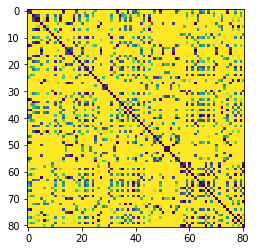

# time_series_classification_2D_convnet_recurrence_plot
Train a 2D convnet to classify pitch velocity sequences by converting data to a 2D recurrence plot visualization.

## Introduction

## Data

## Recurrence Plots

## Model

## Model Evaluation

## Discussion

## Next Steps